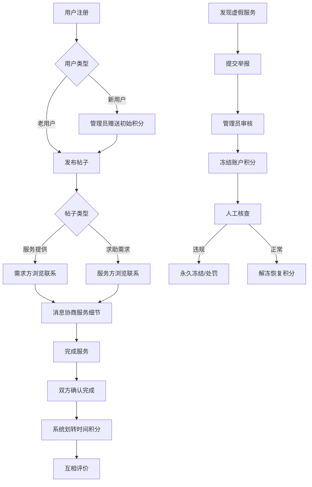

## 1. 产品概述

社区互助时间银行平台，以"时间"作为流通货币，让社区居民通过提供服务获得时间积分，使用服务消耗时间积分，促进邻里互助与社区共建。

- 核心价值：解决社区居民日常互助需求，建立邻里信任机制，让时间成为有价值的社区流通货币
- 目标用户：社区居民、志愿者、社区管理员

## 2. 核心功能

### 2.1 用户角色

| 角色 | 注册方式 | 核心权限 |
|------|----------|----------|
| 普通用户 | 手机号/邮箱注册 | 发布服务帖、发布求助帖、消息沟通、确认服务、查看账户、评价服务、举报违规 |
| 平台管理员 | 后台登录 | 用户管理、积分赠送、举报处理、账户冻结、数据统计 |

### 2.2 功能模块

1. **首页**：服务分类导航、热门服务推荐、最新需求展示、统计数据看板
2. **服务列表页**：分类筛选、搜索、服务提供帖/求助需求帖列表、标签过滤
3. **发布页**：发布服务提供帖、发布求助需求帖、表单填写、分类选择
4. **帖子详情页**：帖子信息展示、联系对方、收藏、举报入口
5. **消息中心**：会话列表、消息发送接收、服务协商沟通
6. **个人中心**：时间余额展示、交易记录、发布管理、评价管理、账户设置
7. **服务确认页**：服务完成确认、积分划转、互相评价
8. **管理员后台**：用户管理、积分管理、举报处理、账户冻结

### 2.3 页面详情

| 页面名称 | 模块名称 | 功能描述 |
|----------|----------|----------|
| 首页 | 分类导航 | 家政协助、技能教学、陪伴探访、托管接送四大分类入口 |
| 首页 | 数据看板 | 平台总服务时长、注册用户数、今日完成服务数 |
| 首页 | 推荐列表 | 热门服务提供、紧急求助需求卡片展示 |
| 服务列表页 | 筛选区域 | 按分类、类型(提供/求助)、时间范围筛选 |
| 服务列表页 | 帖子卡片 | 展示标题、发布者、所需时长、分类标签、发布时间 |
| 发布页 | 表单区域 | 标题、描述、服务类别、预计时长、地点、联系方式 |
| 帖子详情页 | 信息展示 | 完整帖子内容、发布者信息、信用评分 |
| 帖子详情页 | 操作区域 | 联系对方、收藏、举报按钮 |
| 消息中心 | 会话列表 | 显示所有对话、最新消息预览、未读标记 |
| 消息中心 | 聊天窗口 | 实时消息收发、服务快捷确认按钮 |
| 个人中心 | 账户概览 | 时间余额、累计获得、累计消耗、信用等级 |
| 个人中心 | 交易记录 | 收入/支出明细、服务对象、时间、状态 |
| 个人中心 | 评价管理 | 收到的评价、给出的评价、星级展示 |
| 服务确认页 | 确认流程 | 服务完成确认、积分划转确认、评价打分 |
| 管理员后台 | 用户管理 | 用户列表、信用等级调整、初始积分赠送 |
| 管理员后台 | 举报处理 | 举报列表、查看详情、冻结账户、人工核查 |

## 3. 核心流程

### 3.1 服务提供流程
用户注册 → 发布"服务提供"帖 → 需求方浏览并联系 → 双方消息协商细节 → 约定服务时间 → 完成服务 → 双方确认 → 系统划转时间积分 → 互相评价

### 3.2 服务求助流程
用户注册 → 管理员赠送初始积分(可选) → 发布"求助需求"帖 → 服务方浏览并联系 → 双方消息协商细节 → 约定服务时间 → 完成服务 → 双方确认 → 系统划转时间积分 → 互相评价

### 3.3 举报处理流程
用户发现虚假服务 → 提交举报并附证据 → 管理员审核 → 冻结相关账户时间积分 → 人工核查 → 确认违规则永久冻结/正常则解冻并恢复积分

## 4. 用户界面设计

### 4.1 设计风格
- **主色调**：温暖的橙绿色系，主色为#FF6B35（活力橙），辅助色为#2EC4B6（清新绿），代表互助与生机
- **中性色**：以#F8F9FA为背景，#2D3436为主文字，#636E72为次要文字
- **按钮风格**：圆角8px，渐变填充，悬停时有微妙的缩放和阴影变化
- **字体**：标题使用"Noto Serif SC"，正文使用"Noto Sans SC"，营造温暖有信任感的社区氛围
- **布局风格**：卡片式布局，柔和阴影，圆角设计，大量留白营造呼吸感
- **图标**：使用lucide-react图标库，线条风格统一为2px，保持简洁友好

### 4.2 页面设计概览

| 页面名称 | 模块名称 | UI 元素 |
|----------|----------|---------|
| 首页 | Hero区域 | 大标题、平台slogan、统计数据、行动按钮、渐变背景 |
| 首页 | 分类卡片 | 4个大卡片，每个带图标、标题、描述、悬停动画 |
| 首页 | 推荐列表 | 横向滚动卡片，展示热门服务，带发布者头像和评分 |
| 服务列表页 | 顶部筛选 | 标签式分类切换、排序下拉、搜索框 |
| 服务列表页 | 帖子卡片 | 悬浮卡片设计，左侧分类色条，右侧信息和操作按钮 |
| 发布页 | 表单设计 | 分组表单，左侧标签右侧输入，带实时预览 |
| 帖子详情页 | 内容区 | 大标题、富文本内容、发布者信息卡片、相关推荐 |
| 消息中心 | 聊天界面 | 左侧会话列表，右侧聊天窗口，底部输入区 |
| 个人中心 | 账户概览 | 大号时间余额数字、环形进度条展示信用分 |
| 个人中心 | 交易记录 | 时间线式布局，每笔交易带图标和金额变化 |

### 4.3 响应式设计
- **桌面端优先**：采用12列网格布局，最大宽度1280px居中
- **平板端**：≥768px，调整为8列网格，侧边栏转为顶部标签
- **移动端**：<768px，单列布局，底部导航栏，卡片紧凑化
- **触控优化**：按钮最小尺寸44x44px，列表项增加垂直间距，手势滑动支持

### 4.4 动画与交互动效
- 页面加载：内容区域淡入 + 元素错位入场（staggered reveal）
- 卡片悬停：轻微上浮(translateY(-4px)) + 阴影增强 + 边框高亮
- 按钮点击：scale(0.96) 缩放反馈
- 消息发送：气泡从底部滑入 + 发送中动画
- 积分变化：数字滚动动画 + 余额变化高亮闪烁
- 标签切换：内容区域左右滑动切换
