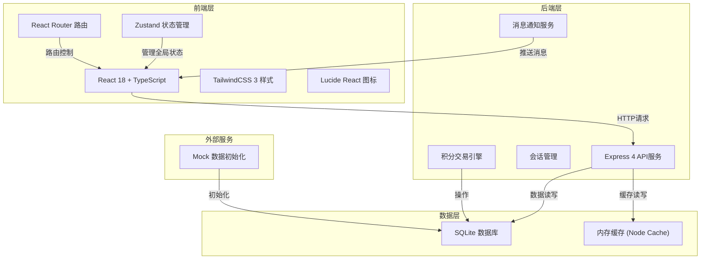
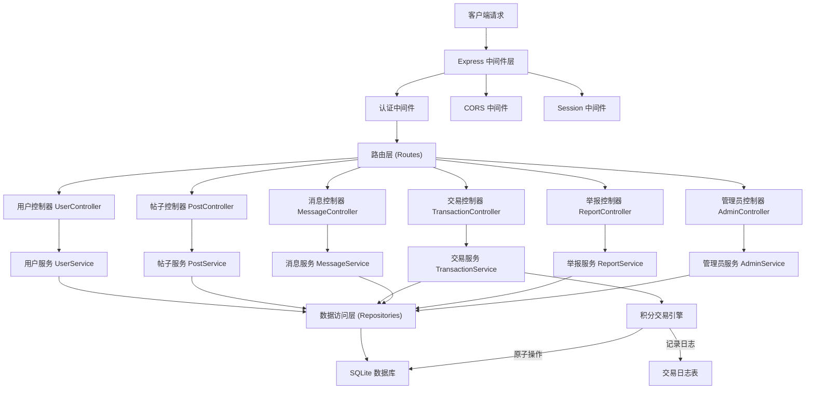
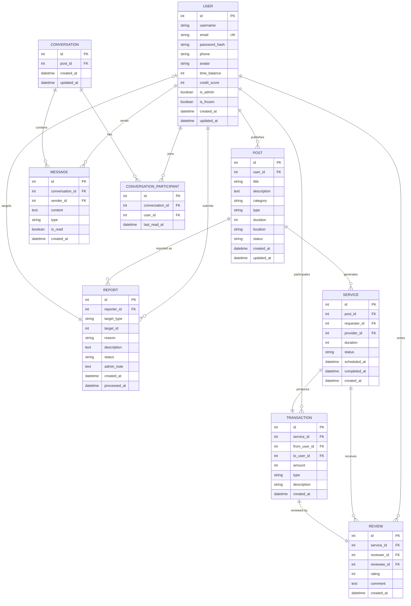

## 1. 架构设计



## 2. 技术栈描述

- **前端框架**: React@18 + TypeScript，使用函数式组件和Hooks
- **构建工具**: Vite@5，提供快速的开发体验和构建优化
- **状态管理**: Zustand@4，轻量级状态管理，管理用户、帖子、消息等全局状态
- **路由管理**: React Router DOM@6，单页应用路由控制
- **样式方案**: TailwindCSS@3 + PostCSS，原子化CSS方案
- **图标库**: Lucide React@0.294，统一风格的图标组件
- **后端框架**: Express@4，基于Node.js的轻量级Web框架
- **数据库**: SQLite@3，轻量级关系型数据库，存储用户、帖子、交易、消息等数据
- **数据访问**: better-sqlite3，同步式SQLite驱动，性能优异
- **会话管理**: express-session + better-sqlite3-session-store，用户登录状态管理
- **密码加密**: bcryptjs，用户密码安全存储

## 3. 路由定义

| 路由路径 | 页面名称 | 权限要求 |
|----------|----------|----------|
| `/` | 首页 | 公开 |
| `/services` | 服务列表页 | 公开 |
| `/services/:id` | 帖子详情页 | 公开 |
| `/publish` | 发布页 | 需登录 |
| `/messages` | 消息中心 | 需登录 |
| `/messages/:conversationId` | 聊天窗口 | 需登录 |
| `/profile` | 个人中心 | 需登录 |
| `/profile/transactions` | 交易记录 | 需登录 |
| `/profile/reviews` | 评价管理 | 需登录 |
| `/service-confirm/:serviceId` | 服务确认页 | 需登录 |
| `/login` | 登录页 | 公开 |
| `/register` | 注册页 | 公开 |
| `/admin` | 管理员后台 | 需管理员 |
| `/admin/users` | 用户管理 | 需管理员 |
| `/admin/reports` | 举报处理 | 需管理员 |

## 4. API 定义

### 4.1 认证接口

```typescript
// 用户注册
POST /api/auth/register
Request: { username: string; email: string; password: string; phone?: string }
Response: { id: number; username: string; email: string; token: string }

// 用户登录
POST /api/auth/login
Request: { email: string; password: string }
Response: { id: number; username: string; email: string; timeBalance: number; token: string }

// 用户登出
POST /api/auth/logout
Response: { success: boolean }

// 获取当前用户信息
GET /api/auth/me
Response: { id: number; username: string; email: string; timeBalance: number; creditScore: number; isAdmin: boolean }
```

### 4.2 帖子接口

```typescript
// 获取帖子列表
GET /api/posts?category=&type=&page=&pageSize=
Response: { list: Post[]; total: number; page: number; pageSize: number }

// 获取帖子详情
GET /api/posts/:id
Response: Post

// 发布帖子
POST /api/posts
Request: { title: string; description: string; category: string; type: 'offer' | 'request'; duration: number; location?: string }
Response: Post

// 搜索帖子
GET /api/posts/search?keyword=
Response: Post[]
```

### 4.3 用户接口

```typescript
// 获取用户信息
GET /api/users/:id
Response: { id: number; username: string; avatar?: string; creditScore: number; completedServices: number; joinDate: string }

// 获取用户发布的帖子
GET /api/users/:id/posts
Response: Post[]

// 赠送初始积分(管理员)
POST /api/users/:id/gift-points
Request: { points: number; reason: string }
Response: { success: boolean; newBalance: number }

// 冻结账户(管理员)
POST /api/users/:id/freeze
Request: { reason: string }
Response: { success: boolean }
```

### 4.4 交易接口

```typescript
// 获取交易记录
GET /api/transactions?page=&pageSize=
Response: { list: Transaction[]; total: number }

// 确认服务完成
POST /api/services/:id/confirm
Request: { rating: number; review?: string }
Response: { success: boolean; transaction: Transaction }

// 获取服务详情
GET /api/services/:id
Response: Service
```

### 4.5 消息接口

```typescript
// 获取会话列表
GET /api/conversations
Response: Conversation[]

// 获取会话消息
GET /api/conversations/:id/messages
Response: Message[]

// 发送消息
POST /api/conversations/:id/messages
Request: { content: string; type: 'text' | 'system' }
Response: Message

// 创建会话
POST /api/conversations
Request: { participantId: number; postId?: number }
Response: Conversation
```

### 4.6 举报接口

```typescript
// 提交举报
POST /api/reports
Request: { type: 'post' | 'user' | 'service'; targetId: number; reason: string; description?: string }
Response: Report

// 获取举报列表(管理员)
GET /api/reports?status=
Response: Report[]

// 处理举报(管理员)
POST /api/reports/:id/process
Request: { action: 'freeze' | 'warn' | 'dismiss'; note?: string }
Response: { success: boolean }
```

## 5. 服务端架构图



## 6. 数据模型

### 6.1 实体关系图



### 6.2 数据库初始化脚本

```sql
-- 用户表
CREATE TABLE IF NOT EXISTS users (
  id INTEGER PRIMARY KEY AUTOINCREMENT,
  username VARCHAR(50) NOT NULL,
  email VARCHAR(100) UNIQUE NOT NULL,
  password_hash VARCHAR(255) NOT NULL,
  phone VARCHAR(20),
  avatar VARCHAR(255),
  time_balance INTEGER DEFAULT 0,
  credit_score INTEGER DEFAULT 100,
  is_admin BOOLEAN DEFAULT 0,
  is_frozen BOOLEAN DEFAULT 0,
  created_at DATETIME DEFAULT CURRENT_TIMESTAMP,
  updated_at DATETIME DEFAULT CURRENT_TIMESTAMP
);

-- 帖子表
CREATE TABLE IF NOT EXISTS posts (
  id INTEGER PRIMARY KEY AUTOINCREMENT,
  user_id INTEGER NOT NULL,
  title VARCHAR(200) NOT NULL,
  description TEXT NOT NULL,
  category VARCHAR(50) NOT NULL,
  type VARCHAR(10) NOT NULL CHECK(type IN ('offer', 'request')),
  duration INTEGER NOT NULL,
  location VARCHAR(200),
  status VARCHAR(20) DEFAULT 'active',
  created_at DATETIME DEFAULT CURRENT_TIMESTAMP,
  updated_at DATETIME DEFAULT CURRENT_TIMESTAMP,
  FOREIGN KEY (user_id) REFERENCES users(id)
);

-- 服务表
CREATE TABLE IF NOT EXISTS services (
  id INTEGER PRIMARY KEY AUTOINCREMENT,
  post_id INTEGER NOT NULL,
  requester_id INTEGER NOT NULL,
  provider_id INTEGER NOT NULL,
  duration INTEGER NOT NULL,
  status VARCHAR(20) DEFAULT 'pending',
  scheduled_at DATETIME,
  completed_at DATETIME,
  created_at DATETIME DEFAULT CURRENT_TIMESTAMP,
  FOREIGN KEY (post_id) REFERENCES posts(id),
  FOREIGN KEY (requester_id) REFERENCES users(id),
  FOREIGN KEY (provider_id) REFERENCES users(id)
);

-- 交易表
CREATE TABLE IF NOT EXISTS transactions (
  id INTEGER PRIMARY KEY AUTOINCREMENT,
  service_id INTEGER,
  from_user_id INTEGER NOT NULL,
  to_user_id INTEGER NOT NULL,
  amount INTEGER NOT NULL,
  type VARCHAR(20) NOT NULL,
  description TEXT,
  created_at DATETIME DEFAULT CURRENT_TIMESTAMP,
  FOREIGN KEY (service_id) REFERENCES services(id),
  FOREIGN KEY (from_user_id) REFERENCES users(id),
  FOREIGN KEY (to_user_id) REFERENCES users(id)
);

-- 会话表
CREATE TABLE IF NOT EXISTS conversations (
  id INTEGER PRIMARY KEY AUTOINCREMENT,
  post_id INTEGER,
  created_at DATETIME DEFAULT CURRENT_TIMESTAMP,
  updated_at DATETIME DEFAULT CURRENT_TIMESTAMP,
  FOREIGN KEY (post_id) REFERENCES posts(id)
);

-- 会话参与者表
CREATE TABLE IF NOT EXISTS conversation_participants (
  id INTEGER PRIMARY KEY AUTOINCREMENT,
  conversation_id INTEGER NOT NULL,
  user_id INTEGER NOT NULL,
  last_read_at DATETIME,
  created_at DATETIME DEFAULT CURRENT_TIMESTAMP,
  UNIQUE(conversation_id, user_id),
  FOREIGN KEY (conversation_id) REFERENCES conversations(id),
  FOREIGN KEY (user_id) REFERENCES users(id)
);

-- 消息表
CREATE TABLE IF NOT EXISTS messages (
  id INTEGER PRIMARY KEY AUTOINCREMENT,
  conversation_id INTEGER NOT NULL,
  sender_id INTEGER NOT NULL,
  content TEXT NOT NULL,
  type VARCHAR(20) DEFAULT 'text',
  is_read BOOLEAN DEFAULT 0,
  created_at DATETIME DEFAULT CURRENT_TIMESTAMP,
  FOREIGN KEY (conversation_id) REFERENCES conversations(id),
  FOREIGN KEY (sender_id) REFERENCES users(id)
);

-- 评价表
CREATE TABLE IF NOT EXISTS reviews (
  id INTEGER PRIMARY KEY AUTOINCREMENT,
  service_id INTEGER NOT NULL,
  reviewer_id INTEGER NOT NULL,
  reviewee_id INTEGER NOT NULL,
  rating INTEGER NOT NULL CHECK(rating BETWEEN 1 AND 5),
  comment TEXT,
  created_at DATETIME DEFAULT CURRENT_TIMESTAMP,
  FOREIGN KEY (service_id) REFERENCES services(id),
  FOREIGN KEY (reviewer_id) REFERENCES users(id),
  FOREIGN KEY (reviewee_id) REFERENCES users(id)
);

-- 举报表
CREATE TABLE IF NOT EXISTS reports (
  id INTEGER PRIMARY KEY AUTOINCREMENT,
  reporter_id INTEGER NOT NULL,
  target_type VARCHAR(20) NOT NULL,
  target_id INTEGER NOT NULL,
  reason VARCHAR(100) NOT NULL,
  description TEXT,
  status VARCHAR(20) DEFAULT 'pending',
  admin_note TEXT,
  created_at DATETIME DEFAULT CURRENT_TIMESTAMP,
  processed_at DATETIME,
  FOREIGN KEY (reporter_id) REFERENCES users(id)
);

-- 创建索引
CREATE INDEX IF NOT EXISTS idx_posts_category ON posts(category);
CREATE INDEX IF NOT EXISTS idx_posts_type ON posts(type);
CREATE INDEX IF NOT EXISTS idx_posts_status ON posts(status);
CREATE INDEX IF NOT EXISTS idx_services_status ON services(status);
CREATE INDEX IF NOT EXISTS idx_transactions_user ON transactions(from_user_id, to_user_id);
CREATE INDEX IF NOT EXISTS idx_messages_conversation ON messages(conversation_id);
CREATE INDEX IF NOT EXISTS idx_reports_status ON reports(status);

-- 初始化管理员账户 (密码: admin123)
INSERT OR IGNORE INTO users (username, email, password_hash, is_admin, time_balance) VALUES 
('admin', 'admin@timebank.com', '$2a$10$rBq8xq3y7z9w8v7u6t5s4r3q2p1o0n9m8l7k6j5h4g3f2e1d0c9b8a7', 1, 100);

-- 初始化测试用户 (密码: 123456)
INSERT OR IGNORE INTO users (username, email, password_hash, time_balance, credit_score) VALUES 
('张三', 'zhangsan@example.com', '$2a$10$N9qo8uLOickgx2ZMRZoMyeIjZAgcfl7p92ldGxad68LJZdL17lhWy', 20, 95),
('李四', 'lisi@example.com', '$2a$10$N9qo8uLOickgx2ZMRZoMyeIjZAgcfl7p92ldGxad68LJZdL17lhWy', 15, 88),
('王五', 'wangwu@example.com', '$2a$10$N9qo8uLOickgx2ZMRZoMyeIjZAgcfl7p92ldGxad68LJZdL17lhWy', 30, 92);

-- 初始化测试帖子
INSERT OR IGNORE INTO posts (user_id, title, description, category, type, duration, location, status) VALUES 
(2, '提供周末老人接送服务', '本人周末有空，可提供接送老人就医、购物等服务，驾驶技术娴熟，有多年驾龄。', 'transport', 'offer', 2, '朝阳区', 'active'),
(3, '需要家政清洁帮助', '家中需要深度清洁，约2小时，主要是厨房和卫生间，希望有经验的朋友帮忙。', 'housework', 'request', 2, '海淀区', 'active'),
(2, '可教授钢琴入门', '音乐专业毕业，可教授钢琴入门课程，适合儿童和成人零基础学习者。', 'teaching', 'offer', 1, '线上/西城区', 'active'),
(4, '需要人陪伴老人聊天', '家中老人独居，希望有人能每周陪伴聊天、散步，每次2小时。', 'companion', 'request', 2, '东城区', 'active'),
(3, '提供周末儿童托管', '有幼教经验，周末可提供2-6岁儿童托管服务，环境安全，有丰富的互动活动。', 'transport', 'offer', 4, '丰台区', 'active'),
(4, '学习英语基础', '想学习英语日常对话，每周1-2次，每次1小时，希望找有耐心的朋友。', 'teaching', 'request', 1, '线上', 'active');
```
